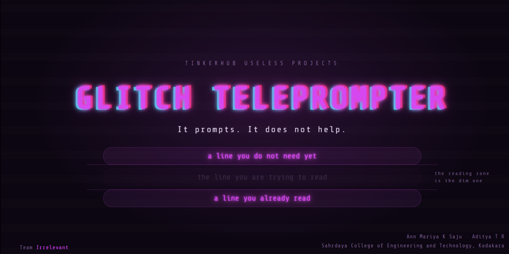
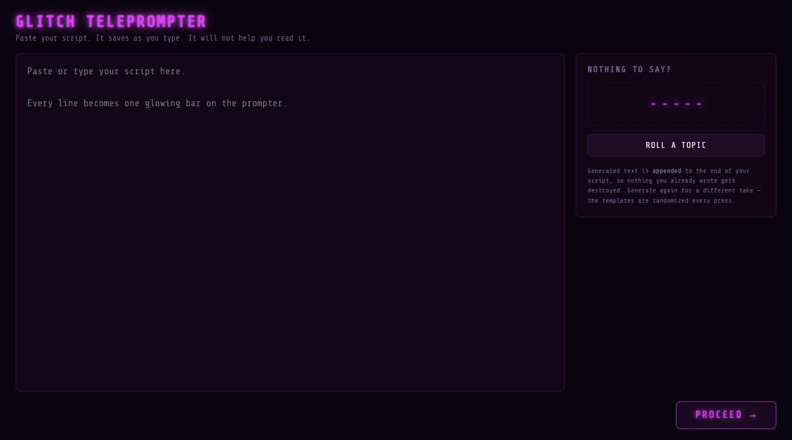
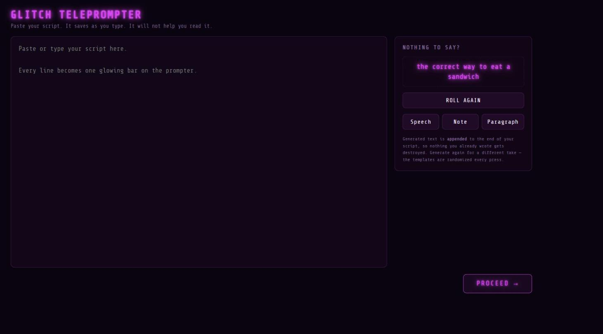
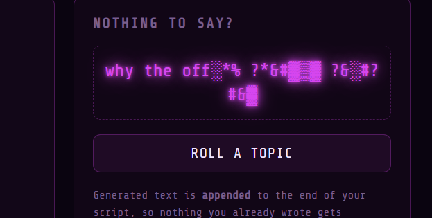
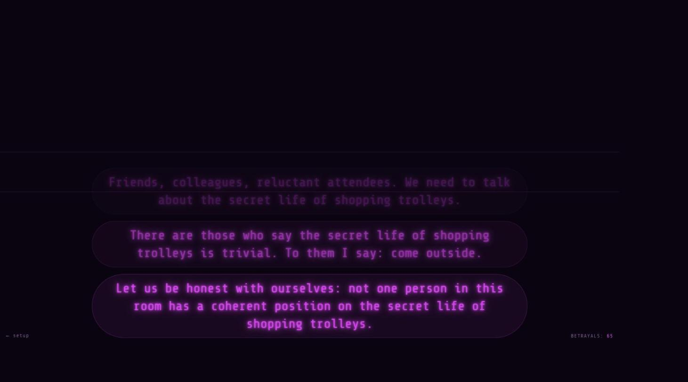
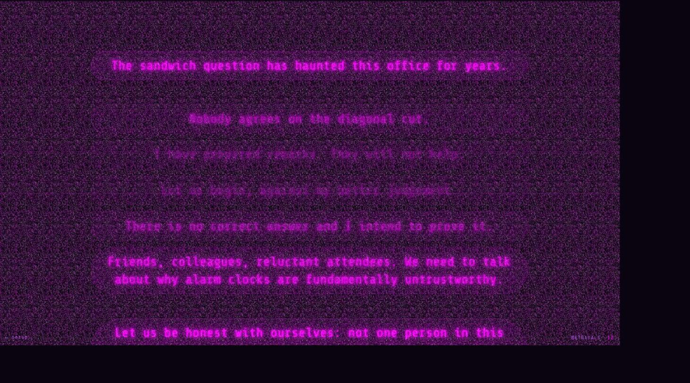
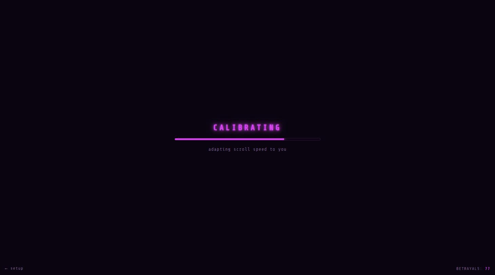
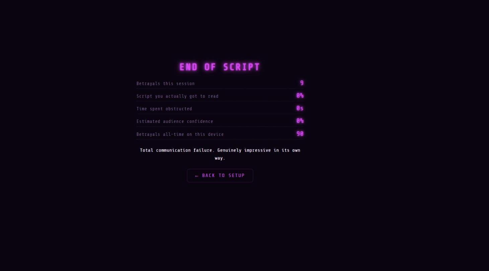
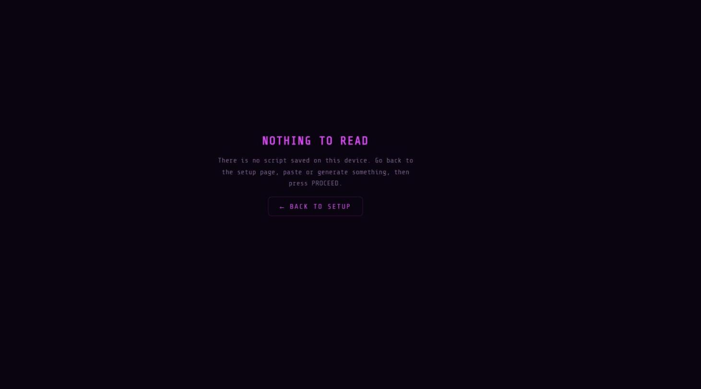
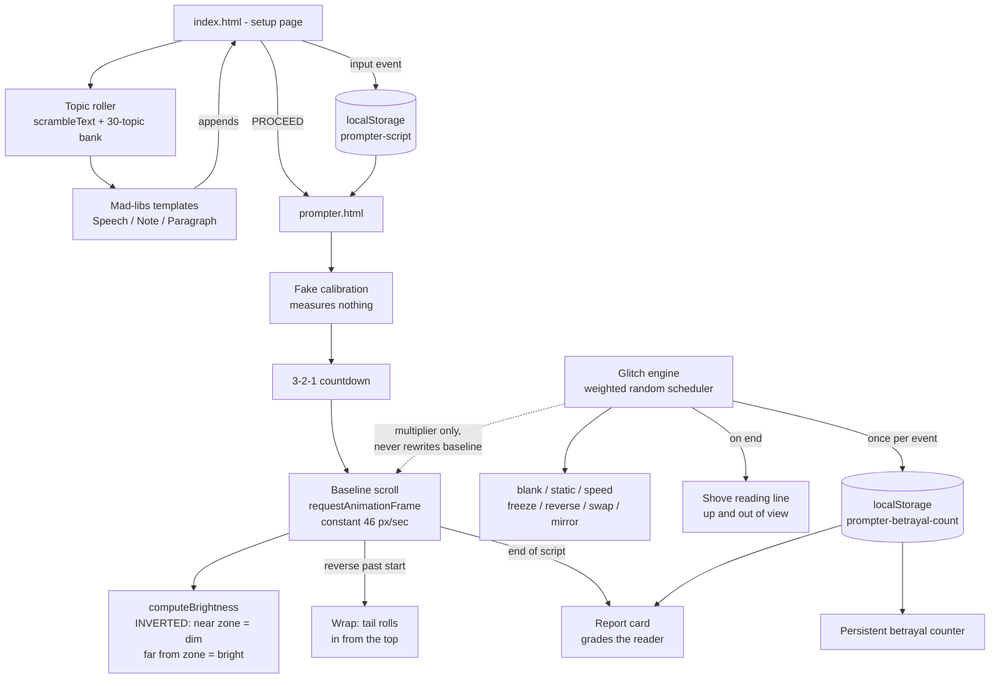

# Glitch Teleprompter 🎯

### *It prompts. It does not help.*


## Basic Details
### Team Name: Irrelevant


### Team Members
- Team Lead: Ann Mariya K Saju - Sahrdaya College of Engineering and Technology, Kodakara
- Member 2: Aditya T R - Sahrdaya College of Engineering and Technology, Kodakara

### Project Description
A teleprompter on nobody's side. The line you're reading is dimmed; the rest glow. It
blacks out, dissolves into static, lurches, runs backwards and rewrites words at random -
then grades you on the mess it made.

### The Problem (that doesn't exist)
Teleprompters have made public speaking far too easy. Newsreaders simply *read the words*
and get away with it. An entire generation of speakers has never once had to improvise
because a machine ate their script mid-sentence. Where is the danger? Where is the sport?
Nobody has ever had to earn a speech.

### The Solution (that nobody asked for)
We built a teleprompter that is on nobody's side. It inverts the one thing every
teleprompter and karaoke screen on earth gets right: the line in the reading zone is the
*dimmest* thing on screen, and your eye is dragged away by the bright, perfectly legible
lines you do not need yet.

On top of that sits a sabotage engine that fires on its own schedule, completely
indifferent to how well you are doing. It can speed the script up, freeze it, run it
backwards, drop the whole screen into television snow, strobe it to black, mirror-flip the
text, or quietly swap a word in a line you have not reached yet so you say "the secret
life of forbidden trolleys" out loud before you notice.

It opens by pretending to calibrate itself to your reading pace, which it does not do. It
closes by grading your performance, which it personally ruined. And it keeps a permanent
count of how many times it has betrayed you, which survives closing the browser.

## Technical Details
### Technologies/Components Used
For Software:
- **Languages:** HTML5, CSS3, JavaScript (vanilla, ES5-style, no transpiler)
- **Frameworks:** None. Deliberately zero framework and zero build step.
- **Libraries:** jsdom (dev dependency, test harness only). Share Tech Mono is embedded
  directly in the stylesheet as a base64 woff2, the grain is generated with Canvas, and
  the glitch audio is synthesised in WebAudio. No image files, no sound files, no CDN:
  the pages make zero network requests and run identically with the wifi switched off.
- **Tools:** Node.js 24, npm, Git, Chrome DevTools

For Hardware:
- Not applicable, this is a software-only project.

### Implementation
For Software:

# Installation
```bash
git clone https://github.com/annmol-hq/Glitch_Teleprompter.git
cd Glitch_Teleprompter

# only needed if you want to run the test suite
npm install
```

# Run
```bash
# There is no build step. Open the setup page directly:
start index.html            # Windows
open index.html             # macOS

# ...or serve it (recommended, keeps localStorage on a real origin):
python -m http.server 8765
# then visit http://127.0.0.1:8765/index.html

# Run the test suite (40 jsdom tests)
npm test
```

### Project Documentation
For Software:

# Screenshots (Add at least 3)


*The setup page. Paste or type a script into the main pane and it auto-saves to
localStorage on every keystroke, so a refresh never loses your work.*


*The random topic generator once it has settled. A topic is drawn from a local 30-entry
bank, then three formats are offered. Everything is generated from local Mad-libs
templates with no API call, so it works with zero internet all day at a booth.*


*The same control caught mid-scramble. Characters lock in from the left while the rest
churn through block-shade glyphs, so the topic resolves out of visible corruption rather
than simply appearing.*


*The core mechanic, and the whole joke, shown at the very first frame after the countdown.
The reading zone sits between the two faint horizontal rules, and the script starts with
its first line already inside it, dim and hard to focus on, while the lines below it glow
brightly. There is no gentle run-up from the bottom of the screen: you are behind from the
moment it begins. Backwards from every real teleprompter, on purpose.*


*A static glitch held open, and yes, that is the whole screen. The grain is full
signal-loss television snow: opaque pixel noise across the full black-to-white range,
composited over the text so nothing shows through for the length of the burst. Six 128px
tiles are rendered to an offscreen canvas once at startup, then cycled every other frame
and re-offset, costing about 38ms at load and no pixel work while running.*


*Before the countdown, the prompter "calibrates to your reading pace". It measures
nothing, adapts nothing, and discards the result. The glitch schedule was always going to
be random. A test asserts this step can never touch the engine, because the moment it did,
the joke would stop being true.*


*The end of a run. The tool grades you on a performance it personally ruined, then keeps
the all-time betrayal tally so the number follows you between sessions.*


*With no script saved, the prompter explains itself and offers a way back instead of
showing an unexplained black screen.*

# Diagrams



*Two independent systems drive the reading screen. The baseline scroll runs at a constant
pace and is never modified. The glitch engine only ever supplies a multiplier applied on
top of that baseline, which is why the normal reading pace always resumes cleanly the
instant a glitch ends. The betrayal counter increments once per glitch event, not once per
frame the glitch is active.*

For Hardware:
- Not applicable, this is a software-only project.

### Project Demo
# Video

https://github.com/user-attachments/assets/1eb1da56-905c-4f68-8551-24037dedf5b7

*A full run: pasting a script on the setup page, rolling a random topic and generating a
speech from it, then pressing PROCEED and trying to read the result aloud through the fake
calibration, the countdown, and the glitches that follow.*

# Additional Demos

**Test suite.** `npm test` runs 40 jsdom tests covering persistence, the topic generator,
all three format templates, navigation, the empty-script state, the betrayal counter, the
sabotage layer, the report card arithmetic, and the scroll wrap-around.

The inverted brightness rule is the one thing most likely to get built backwards by
accident, so it is asserted explicitly rather than eyeballed, and the assertion was
mutation-tested: flipping `computeBrightness` to the conventional orientation makes three
tests fail, which proves the test can actually detect the mistake.

## Team Contributions
- Ann Mariya K Saju: Concept and the inverted brightness rule that the whole joke rests on.
  Built the setup page - the autosaving script editor, the character-scramble topic roller,
  and the local Mad-libs generators for the Speech, Note and Paragraph formats. Owned
  localStorage persistence across both pages and the offline-first constraint that keeps the
  tool working at a booth with no internet.
- Aditya T R: Built the reading screen - the requestAnimationFrame scroll loop, the
  brightness falloff, and the sabotage engine with its seven effects and weighted scheduler.
  Wrote the Canvas signal-loss grain, the WebAudio glitch bursts, the wrap-around reverse
  scroll, and the end-of-run report card. Owned the jsdom test suite.

---
Made with ❤️ at TinkerHub Useless Projects 


