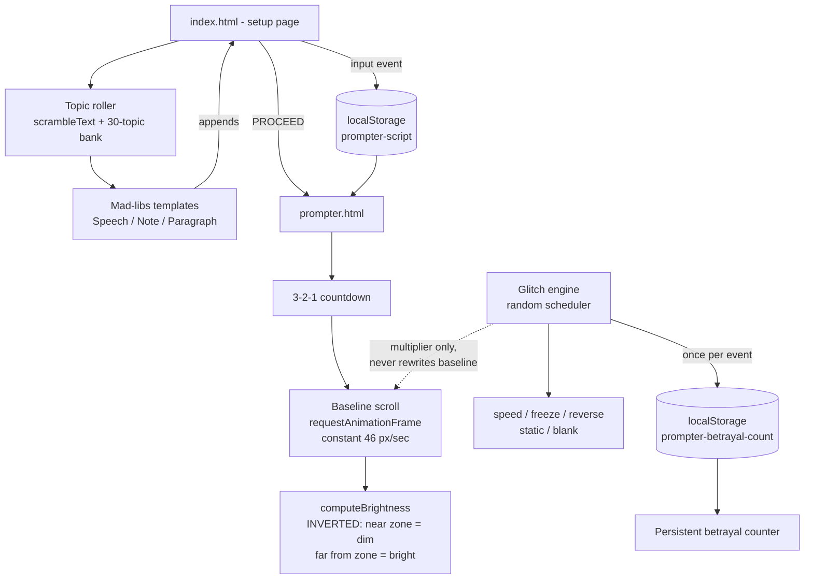

# Glitch Teleprompter 🎯


## Basic Details
### Team Name: [FILL IN]


### Team Members
- Team Lead: [FILL IN] - [College]
- Member 2: [FILL IN] - [College]
- Member 3: [FILL IN] - [College]

### Project Description
A two-page web teleprompter that scrolls your script at a calm, steady reading pace
and then actively works against you. At random intervals it speeds up, freezes,
reverses, bursts into static, or blanks out entirely. The line you are supposed to be
reading is dimmed almost to nothing, while the lines you are not reading glow brightly.

### The Problem (that doesn't exist)
Teleprompters have made public speaking far too easy. Newsreaders simply *read the words*
and get away with it. An entire generation of speakers has never once had to improvise
because a machine ate their script mid-sentence. Where is the danger? Where is the sport?
Nobody has ever had to earn a speech.

### The Solution (that nobody asked for)
We built a teleprompter that is on nobody's side. It inverts the one thing every
teleprompter and karaoke screen on earth gets right: the line in the reading zone is the
*dimmest* thing on screen, and your eye is dragged away by the bright, perfectly legible
lines you do not need yet. On top of that sits a sabotage engine that fires on its own
schedule, completely indifferent to how well you are doing. It keeps a permanent count of
how many times it has betrayed you, and that number survives closing the browser.

## Technical Details
### Technologies/Components Used
For Software:
- **Languages:** HTML5, CSS3, JavaScript (vanilla, ES5-style, no transpiler)
- **Frameworks:** None. Deliberately zero framework and zero build step.
- **Libraries:** jsdom (dev dependency, test harness only); Share Tech Mono via Google Fonts
- **Tools:** Node.js 24, npm, Git, Chrome DevTools

For Hardware:
- Not applicable, this is a software-only project.

### Implementation
For Software:

# Installation
```bash
git clone https://github.com/annmol-hq/princess_ennui_of_whynotia.git
cd princess_ennui_of_whynotia

# only needed if you want to run the test suite
npm install
```

# Run
```bash
# There is no build step. Open the setup page directly:
start index.html            # Windows
open index.html             # macOS

# ...or serve it (recommended, keeps localStorage on a real origin):
python -m http.server 8765
# then visit http://127.0.0.1:8765/index.html

# Run the test suite (23 jsdom tests)
npm test
```

### Project Documentation
For Software:

# Screenshots (Add at least 3)


*The setup page. Paste or type a script into the main pane and it auto-saves to
localStorage on every keystroke, so a refresh never loses your work.*


*The random topic generator once it has settled. A topic is drawn from a local 30-entry
bank, then three formats are offered. Everything is generated from local Mad-libs
templates with no API call, so it works with zero internet all day at a booth.*


*The same control caught mid-scramble. Characters lock in from the left while the rest
churn through block-shade glyphs, so the topic resolves out of visible corruption rather
than simply appearing.*


*The core mechanic, and the whole joke. The reading zone sits between the two faint
horizontal rules, and the line inside it is rendered at 0.26 opacity while the lines above
and below climb to 1.0. Measured at this exact frame: 0.26 at 40px from the zone centre,
0.46 at 102px, 0.79 at 203px, 1.0 at 449px. Backwards from every real teleprompter, on
purpose.*


*A static glitch held open. The grain is real pixel noise: five 96px tiles are rendered to
an offscreen canvas once at startup and then cycled and re-offset per frame, which costs
about 30ms at load and no pixel work at all while running. Note the betrayal counter in
the bottom right, which persists across sessions, and that the inversion still holds
during a glitch: the middle lines are the dim ones because they are in the reading zone.*


*With no script saved, the prompter explains itself and offers a way back instead of
showing an unexplained black screen.*

# Diagrams



*Two independent systems drive the reading screen. The baseline scroll runs at a constant
pace and is never modified. The glitch engine only ever supplies a multiplier applied on
top of that baseline, which is why the normal reading pace always resumes cleanly the
instant a glitch ends. The betrayal counter increments once per glitch event, not once per
frame the glitch is active.*

For Hardware:
- Not applicable, this is a software-only project.

### Project Demo
# Video
[ADD YOUR DEMO VIDEO LINK HERE]
*Suggested run of show: paste a script on the setup page, roll a random topic and generate
a speech from it, hit PROCEED, then try to read the result aloud through the countdown and
at least two glitches.*

# Additional Demos

**Test suite.** `npm test` runs 23 jsdom tests covering persistence, the topic generator,
all three format templates, navigation, the empty-script state, the betrayal counter, and
the sabotage layer.

The inverted brightness rule is the one thing most likely to get built backwards by
accident, so it is asserted explicitly rather than eyeballed, and the assertion was
mutation-tested: flipping `computeBrightness` to the conventional orientation makes three
tests fail, which proves the test can actually detect the mistake.

## Team Contributions
- [Name 1]: [Specific contributions]
- [Name 2]: [Specific contributions]
- [Name 3]: [Specific contributions]

---
Made with ❤️ at TinkerHub Useless Projects 


